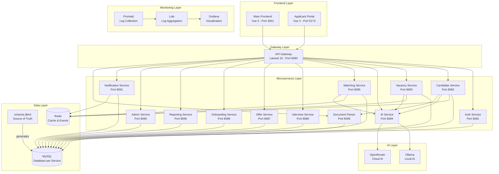

# Candidacy System Architecture

Comprehensive architecture documentation for the AI-powered Candidacy recruitment platform.

## Overview

Candidacy is built using a **microservices architecture** with 12 independent services, two frontend applications, and a central API gateway. The system leverages event-driven communication, database-per-service pattern, and AI integration for intelligent recruitment operations. The database schema is managed as code using **DBML (Database Markup Language)** as the single source of truth.

## Architecture Diagram



## Frontend Layout Architecture

The main frontend uses a **sidebar-based dashboard layout**:

```
┌─────────────────────────────────────────────────────────────────┐
│  AppHeader (Toggle, Breadcrumb, Search, Theme, User)           │
├──────────────┬──────────────────────────────────────────────────┤
│              │                                                  │
│  AppSidebar  │              Main Content Area                   │
│  (260px)     │              (Router View)                       │
│              │                                                  │
│  - Dashboard │  ┌────────────────────────────────────────────┐  │
│  - Candidates│  │  Page Header                               │  │
│  - Vacancies │  │  ─────────────────────────────────────────│  │
│  - Matches   │  │                                            │  │
│  - Interviews│  │  Stats / Cards / Tables                    │  │
│  - Offers    │  │                                            │  │
│  - Reports   │  │                                            │  │
│  - Admin     │  └────────────────────────────────────────────┘  │
│              │                                                  │
└──────────────┴──────────────────────────────────────────────────┘
```

**Key Components:**
- `DashboardLayout.vue` - Main layout wrapper with sidebar state
- `AppSidebar.vue` - Collapsible navigation (260px → 64px icon mode)
- `AppHeader.vue` - Top bar with toggle, search, theme switch

## Core Principles

### 1. Microservices Architecture
Each service is:
- **Independent**: Can be deployed, scaled, and updated separately
- **Single Responsibility**: Handles one business domain
- **Loosely Coupled**: Minimal dependencies on other services
- **Technology Agnostic**: Can use different tech stacks if needed

### 2. Database Per Service
Each service has its own database:
- `candidacy_auth` - User authentication data
- `candidacy_candidate` - Candidate profiles, CVs, experience
- `candidacy_vacancy` - Job postings and requirements
- `candidacy_ai` - AI processing and job tracking
- `candidacy_matching` - Match records and scores
- `candidacy_interview` - Interview schedules and feedback
- `candidacy_offer` - Job offers and acceptance
- `candidacy_onboarding` - Onboarding tasks and progress
- `candidacy_reporting` - Aggregated metrics
- `candidacy_admin` - System settings
- `candidacy_notification` - Notification history
- `candidacy_document_parser` - Temporary storage for parsing operations

**Database-as-Code (DBML)**:
The schema uses a **modular DBML structure** with 14 files in `database/dbml/`:

```
database/dbml/
├── project.dbml        # Project metadata and settings
├── enums.dbml          # Shared enumerations (status, types)
├── auth.dbml           # Auth service tables (users, roles, permissions)
├── admin.dbml          # Admin service tables (settings, change_logs)
├── candidate.dbml      # Candidate service tables
├── vacancy.dbml        # Vacancy service tables
├── matching.dbml       # Matching service tables
├── interview.dbml      # Interview service tables
├── offer.dbml          # Offer service tables
├── onboarding.dbml     # Onboarding service tables
├── notification.dbml   # Notification service (stateless)
├── ai.dbml             # AI service (stateless)
├── document_parser.dbml # Document parser tables
└── relationships.dbml  # Cross-service logical relationships
```

The root `schema.dbml` is **auto-generated** by combining these files via `make dbml-sql`.

**Benefits:**
- Service-specific schema ownership
- Uniform indexing strategies
- Cross-service relationship documentation
- Automated SQL generation to `database/sql/*.sql`

### 3. Event-Driven Communication
Services communicate via:
- **Synchronous**: HTTP REST APIs for request-response
- **Asynchronous**: Redis Pub/Sub for events, Database/Redis Queues for background jobs

Example event flow:
```
Candidate uploads CV
  ↓
Candidate Service publishes "CVUploaded" event
  ↓
Matching Service subscribes and triggers matching
  ↓
Notification Service subscribes and sends confirmation email
```

## Service Responsibilities

### Auth Service
- User authentication and authorization
- JWT token generation and validation
- Role-based access control (RBAC)
- User management

### Candidate Service
- Candidate profile management
- CV upload and storage
- Experience and education tracking
- Integrates with AI Service for analysis
- Integrates with Document Parser for text extraction
- **Reliability**: Uses Database Queue for critical CV parsing jobs

### Vacancy Service
- Job posting management
- Vacancy lifecycle tracking
- Integrates with AI Service for JD generation

### AI Service
- Centralized AI operations
- CV Analysis (extract skills, experience, education)
- Job description generation
- Candidate-vacancy matching
- Interview questionnaire generation
- Supports Ollama (local) and OpenRouter (cloud)

### Matching Service
- AI-powered candidate-vacancy matching
- Match scoring (0-100)
- Detailed analysis generation
- Integrates with AI, Candidate, and Vacancy services

### Document Parser Service
- Asynchronous PDF and DOCX text extraction
- High-performance text parsing
- Reduces load on Candidate Service
- Independent scaling for document-intensive tasks

### Interview Service
- Interview scheduling and management
- Interviewer assignment
- Feedback collection
- Status tracking

### Offer Service
- Job offer creation and management
- Acceptance/rejection workflow
- Offer letter generation
- Expiration tracking

### Onboarding Service
- New hire onboarding workflow
- Customizable task checklists
- Progress tracking
- Deadline management

### Reporting Service
- Analytics and metrics aggregation
- Dashboard KPIs
- Recruitment pipeline analytics
- Time-to-hire, conversion rates
- Interviewer performance metrics

### Admin Service
- **Centralized configuration management** (40+ settings)
- 8 configuration categories: System, AI, Document Parser, Matching, Recruitment, Storage, Features, UI
- Settings API with category filtering and change history
- System health monitoring (all 12 services)
- AI provider configuration (Ollama/OpenRouter)
- UI customization (colors, layouts, themes)

### Notification Service
- Email and notification delivery
- Template management
- Delivery tracking
- Queue-based async sending

## Communication Patterns

### 1. Synchronous (HTTP REST)
Used for:
- Request-response operations
- Data retrieval
- Real-time operations

Example:
```
Frontend → API Gateway → Candidate Service
GET /api/candidates/123
← Candidate data
```

### 2. Asynchronous (Redis Pub/Sub)
Used for:
- Event notifications
- Decoupled operations
- Background processing

Example:
```
Offer Service publishes "OfferAccepted" event
  ↓ Redis Pub/Sub
Onboarding Service subscribes → Creates onboarding record
Notification Service subscribes → Sends congratulations email
Vacancy Service subscribes → Marks vacancy as filled
```

### 3. Service-to-Service
Services can call each other directly:
```
Matching Service → Candidate Service (get candidate data)
Matching Service → Vacancy Service (get vacancy data)
Matching Service → AI Service (perform matching)
```

## Data Flow Examples

### CV Upload and Parsing
```
1. User uploads CV via Frontend
   ↓
2. Frontend → API Gateway → Candidate Service
   ↓
3. Candidate Service stores file
   ↓
4. Candidate Service → Document Parser Service (extract text)
   ↓
5. Document Parser returns raw text
   ↓
6. Candidate Service → AI Service (analyze text)
   ↓
7. AI Service returns skills, experience, education
   ↓
8. Candidate Service saves candidate profile
   ↓
9. Candidate Service publishes "CandidateCreated" event
```

### Candidate Matching
```
1. HR creates vacancy via Frontend
   ↓
2. Frontend → API Gateway → Vacancy Service
   ↓
3. Vacancy Service publishes "VacancyCreated" event
   ↓
4. Matching Service subscribes to event
   ↓
5. Matching Service → AI Service (calculate matches)
   ↓
6. AI Service returns scores and analysis
   ↓
7. Matching Service saves match records
```

### Offer to Onboarding
```
1. HR creates offer via Frontend
   ↓
2. Offer Service creates offer record
   ↓
3. Notification Service sends offer email
   ↓
4. Candidate accepts offer (via Applicant Portal)
   ↓
5. Offer Service publishes "OfferAccepted" event
   ↓
6. Onboarding Service subscribes to event
   ↓
7. Onboarding Service creates onboarding record
   ↓
8. Onboarding Service applies checklist template
   ↓
9. Notification Service sends welcome email
```

## Scalability

### Horizontal Scaling
Services can be scaled independently:
- **High Load Services**: Candidate, Matching, AI
- **Medium Load**: Vacancy, Interview, Offer
- **Low Load**: Admin, Onboarding

### Vertical Scaling
- AI Service benefits from GPU resources
- Database can be scaled with read replicas
- Redis can be clustered for high availability

### Caching Strategy
- **API Gateway**: Service health, public data
- **Admin Service**: Settings (10 min TTL)
- **Matching Service**: Match results (1 hour TTL)
- **Reporting Service**: Dashboard metrics (5 min TTL)

## Security

### Authentication Flow
```
1. User logs in via Frontend
   ↓
2. Frontend → API Gateway → Auth Service
   ↓
3. Auth Service validates credentials
   ↓
4. Auth Service generates JWT token
   ↓
5. Frontend stores token
   ↓
6. All subsequent requests include token
   ↓
7. API Gateway validates token
   ↓
8. Request forwarded to target service
```

### Security Layers
- **API Gateway**: CORS, rate limiting, token validation
- **Services**: Role-based access control
- **Database**: Encrypted connections, user isolation
- **Files**: Secure storage, access control
- **Logs**: Sensitive data redaction

## Monitoring & Logging

### Centralized Logging
```
All Services → Docker logs
  ↓
Promtail (log collection)
  ↓
Loki (log aggregation)
  ↓
Grafana (visualization)
```

### Metrics Tracked
- Request count per endpoint
- Response times
- Error rates
- Service availability
- Queue lengths
- Database connections

### Health Checks
Each service exposes `/health` endpoint:
- Database connectivity
- Redis connectivity
- External service connectivity (AI)
- Disk space
- Memory usage

## Deployment

### Docker Compose (Development)
```bash
docker-compose up -d
```

All services run in containers with:
- Shared network for inter-service communication
- Volume mounts for development
- Environment variable configuration

### Production (Kubernetes - Planned)
- Each service as a Deployment
- Horizontal Pod Autoscaling
- Service mesh for traffic management
- Persistent volumes for databases
- Ingress for external access

## Monitoring & Logging

### Centralized Logging
Unified logging for all 12 microservices:
```
Services → Docker Logs → Promtail → Loki → Grafana
```

## Technology Stack Summary

| Layer | Technology |
|-------|------------|
| Frontend | Vue 3, Vite, Pinia, Axios |
| Frontend Layout | Sidebar-based DashboardLayout |
| Gateway | Laravel 10 |
| Services | Laravel 10 |
| Database | MySQL 8.0 (Managed via DBML) |
| Cache/Events | Redis 7 |
| AI | Ollama, OpenRouter |
| Configuration | Admin Service (40+ settings) |
| Monitoring | Loki, Promtail, Grafana |
| Architecture | Microservices, Event-Driven |

## Best Practices

1. **Modular DBML**: Edit service-specific files in `database/dbml/`, then run `make dbml-sql` to regenerate.
2. **Standardized Responses**: All APIs follow the `BaseApiController` pattern.
3. **Shared Middleware**: Core security and headers are shared across services.
4. **Asynchronous Processing**: Heavy tasks like parsing and AI are separated.
5. **Centralized Configuration**: All settings managed via Admin Service with change history.
6. **Component-Based Frontend**: Reusable layout components (`DashboardLayout`, `AppSidebar`, `AppHeader`).
