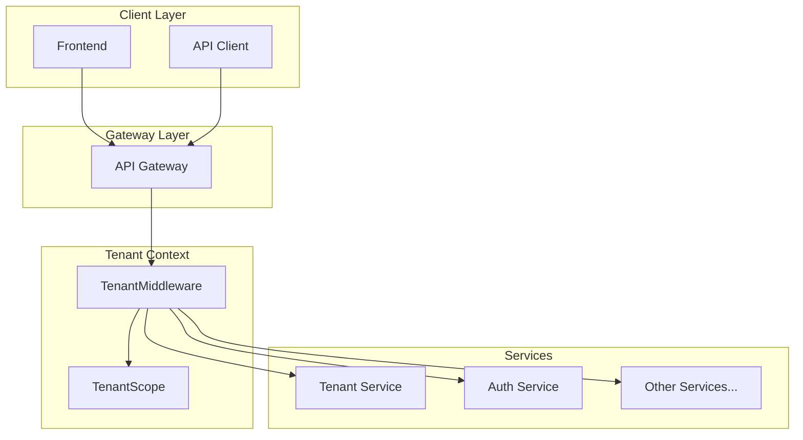

# Multitenancy Guide

This document describes the multitenancy implementation in the Candidacy platform. Multitenancy allows multiple organizations to use the same application instance with complete data isolation.

## Overview

Candidacy uses a **shared database with tenant_id column** approach for multitenancy. This means:
- All tenants share the same database tables
- Each record has a `tenant_id` column for isolation
- Laravel global scopes automatically filter queries by tenant
- Tenant context is resolved from JWT claims or HTTP headers

## Architecture


```mermaid
graph TB
    subgraph "Client Layer"
        WEB[Frontend]
        API[API Client]
    end
    
    subgraph "Gateway Layer"
        GW[API Gateway]
    end
    
    subgraph "Tenant Context"
        TM[TenantMiddleware]
        TS[TenantScope]
    end
    
    subgraph "Services"
        TENANT[Tenant Service]
        AUTH[Auth Service]
        OTHER[Other Services...]
    end
    
    WEB --> GW
    API --> GW
    GW --> TM
    TM --> TS
    TM --> AUTH
    TM --> TENANT
    TM --> OTHER
```

## Key Components

### Tenant Service
The `tenant-service` manages tenant CRUD operations:
- **Tenants**: Organizations using the platform
- **Tenant Users**: User memberships with roles
- **Invitations**: Token-based invitation flow
- **API Keys**: Programmatic access for integrations

### Shared Components

| Component | Path | Purpose |
|-----------|------|---------|
| `BelongsToTenant` | `shared/Traits/` | Trait for tenant-scoped models |
| `TenantScope` | `shared/Scopes/` | Global scope for automatic filtering |
| `TenantMiddleware` | `shared/Http/Middleware/` | Resolves tenant from request |
| `RequireTenant` | `shared/Http/Middleware/` | Enforces tenant context |

## Usage

### Making a Model Tenant-Aware

```php
<?php

namespace App\Models;

use Illuminate\Database\Eloquent\Model;
use Shared\Traits\BelongsToTenant;

class Candidate extends Model
{
    use BelongsToTenant;
    
    // Model will automatically:
    // - Filter queries by current tenant
    // - Set tenant_id on new records
}
```

### Bypassing Tenant Scope

```php
// Query all tenants (admin operations)
$allCandidates = Candidate::withoutTenant()->get();

// Query specific tenant
$tenantCandidates = Candidate::forTenant(123)->get();
```

### Setting Tenant Context Manually

```php
// In tests or commands
app()->instance('tenant.id', $tenantId);

// Now all queries will be scoped to this tenant
$candidates = Candidate::all(); // Filtered by tenant_id
```

## Tenant Identification

Tenant context is resolved in this priority:
1. `X-Tenant-ID` header (explicit)
2. JWT `tenant_id` claim (from authentication)
3. User's `current_tenant_id` field (fallback)

### HTTP Header
```bash
curl -X GET http://localhost:9080/api/candidates \
  -H "Authorization: Bearer $TOKEN" \
  -H "X-Tenant-ID: 1"
```

### JWT Claims
The auth service embeds `tenant_id`, `user_id`, and `roles` in JWT tokens:
```php
public function getJWTCustomClaims()
{
    return [
        'tenant_id' => $this->current_tenant_id,
        'user_id'   => $this->id,
        'roles'     => $this->roles->pluck('name'),
    ];
}
```

### Switching Tenants
Users can switch their active tenant without logging out:
```bash
curl -X POST http://localhost:9080/api/auth/switch-tenant \
  -H "Authorization: Bearer $TOKEN" \
  -H "Content-Type: application/json" \
  -d '{"tenant_id": 2}'
# Returns a new JWT with updated tenant_id claim
```

## API Endpoints

### Tenant Management
| Method | Endpoint | Description |
|--------|----------|-------------|
| GET | `/api/tenants` | List user's tenants |
| POST | `/api/tenants` | Create new tenant |
| GET | `/api/tenants/{uuid}` | Get tenant details |
| PUT | `/api/tenants/{uuid}` | Update tenant |
| DELETE | `/api/tenants/{uuid}` | Delete tenant |
| POST | `/api/tenants/{uuid}/switch` | Switch active tenant |

### Member Management
| Method | Endpoint | Description |
|--------|----------|-------------|
| GET | `/api/tenants/{uuid}/members` | List members |
| POST | `/api/tenants/{uuid}/members` | Add member |
| PUT | `/api/tenants/{uuid}/members/{id}` | Update member role |
| DELETE | `/api/tenants/{uuid}/members/{id}` | Remove member |
| POST | `/api/tenants/{uuid}/leave` | Leave tenant |

### Invitations
| Method | Endpoint | Description |
|--------|----------|-------------|
| GET | `/api/tenants/{uuid}/invitations` | List pending invitations |
| POST | `/api/tenants/{uuid}/invitations` | Create invitation |
| DELETE | `/api/tenants/{uuid}/invitations/{id}` | Cancel invitation |
| GET | `/api/invitations/{token}` | Get invitation details |
| POST | `/api/invitations/{token}/accept` | Accept invitation |

## Role Hierarchy

Roles are hierarchical, with higher levels having more permissions:

| Role | Level | Permissions |
|------|-------|-------------|
| `owner` | 6 | Full control, can delete tenant |
| `admin` | 5 | Manage members, settings |
| `manager` | 4 | Manage hiring process |
| `recruiter` | 3 | Create vacancies, manage candidates |
| `interviewer` | 2 | Conduct interviews, provide feedback |
| `member` | 1 | View-only access |

## Subscription Plans

Tenants have subscription limits:

| Plan | Max Users | Max Candidates | Max Vacancies |
|------|-----------|----------------|---------------|
| `free` | 5 | 100 | 10 |
| `starter` | 15 | 500 | 25 |
| `professional` | 50 | 2000 | 100 |
| `enterprise` | Unlimited | Unlimited | Unlimited |

## Database Schema

### Tenant Tables (candidacy_tenant)
- `tenants` - Organization records
- `tenant_users` - User memberships
- `tenant_invitations` - Pending invitations
- `tenant_api_keys` - API keys for integrations

### Tenant-Scoped Tables
All these tables have a `tenant_id` column:
- `auth.users` (stores current tenant association)
- `candidates`, `cv_files`, `cv_parsing_jobs`
- `vacancies`, `vacancy_questions`
- `matches`
- `interviews`, `interview_feedback`
- `offers`
- `onboarding_checklists`
- `notification_templates`, `notification_logs`

## Migration Guide

For existing installations, run:

```bash
# 1. Run tenant-service migrations
docker compose exec tenant-service php artisan migrate --force

# 2. Create a default tenant
docker compose exec tenant-service php artisan tinker
>>> App\Models\Tenant::create(['name' => 'Default', 'slug' => 'default', 'status' => 'active']);

# 3. Run tenant_id migrations on all business services (or use make)
make migrate-tenants

# Equivalently, run each service individually:
docker compose exec auth-service php artisan migrate --force
docker compose exec candidate-service php artisan migrate --force
docker compose exec vacancy-service php artisan migrate --force
docker compose exec matching-service php artisan migrate --force
docker compose exec interview-service php artisan migrate --force
docker compose exec offer-service php artisan migrate --force
docker compose exec onboarding-service php artisan migrate --force
docker compose exec notification-service php artisan migrate --force

# 4. Backfill existing data (sets tenant_id = 1 for all pre-existing records)
docker compose exec candidate-service php artisan tinker
>>> DB::statement('UPDATE candidates SET tenant_id = 1 WHERE tenant_id IS NULL');
>>> DB::statement('UPDATE vacancies SET tenant_id = 1 WHERE tenant_id IS NULL');
# ... repeat for other tables as needed
```

## Testing

### Running Tenant Isolation Tests

```bash
# Run all tenant isolation tests (all services)
make test-tenant-isolation

# Run for a specific service
docker compose exec candidate-service php artisan test --filter TenantIsolationTest
docker compose exec vacancy-service php artisan test --filter TenantIsolationTest
docker compose exec interview-service php artisan test --filter TenantIsolationTest
docker compose exec offer-service php artisan test --filter TenantIsolationTest
docker compose exec onboarding-service php artisan test --filter TenantIsolationTest
docker compose exec notification-service php artisan test --filter TenantIsolationTest
```

### Test Files
| Service | Test File |
|---------|----------|
| candidate-service | `tests/Feature/TenantIsolationTest.php` |
| vacancy-service | `tests/Feature/TenantIsolationTest.php` |
| matching-service | `tests/Feature/TenantIsolationTest.php` |
| interview-service | `tests/Feature/TenantIsolationTest.php` |
| offer-service | `tests/Feature/TenantIsolationTest.php` |
| onboarding-service | `tests/Feature/TenantIsolationTest.php` |
| notification-service | `tests/Feature/TenantIsolationTest.php` |

### What is Tested
- Cross-tenant data is invisible (global scope applied)
- `find()` returns `null` for records from other tenants
- `withoutTenant()` scope bypasses filtering (admin use)
- `tenant_id` is auto-stamped on `create()` from context
- `belongsToTenant()` / `belongsToCurrentTenant()` helpers
- HTTP API responses only contain own-tenant records

### Writing New Tenant Tests
```php
protected function setUp(): void
{
    parent::setUp();
    app()->instance('tenant.id', 1); // bind tenant context
}

protected function tearDown(): void
{
    app()->forgetInstance('tenant.id'); // always clean up
    parent::tearDown();
}

public function test_records_are_scoped(): void
{
    // Factory already includes tenant_id = 1 by default
    $record = MyModel::factory()->create();
    $this->assertEquals(1, $record->tenant_id);

    // Switch to tenant 2 — record is invisible
    app()->instance('tenant.id', 2);
    $this->assertNull(MyModel::find($record->id));
}
```

## Troubleshooting

### "Tenant context is required" error
Ensure you're sending the `X-Tenant-ID` header or have a valid JWT token.

### Data not appearing
Check that the tenant context is set correctly. Use `withoutTenant()` to debug.

### Cannot create records
Verify that `app('tenant.id')` returns a valid tenant ID before creating records.

## Frontend Tenant Management UI

The frontend provides a user interface for workspace management:

### Routes
| Route | Component | Description |
|-------|-----------|-------------|
| `/tenants` | `TenantList.vue` | List all accessible workspaces |
| `/tenants/{uuid}` | `TenantDetail.vue` | View workspace details |
| `/admin/workspaces` | `TenantList.vue` | Admin workspace management |
| `/admin/workspaces/{uuid}` | `TenantDetail.vue` | Admin workspace details |

### Features
- **Workspace List**: View all accessible workspaces, create new ones, switch between them
- **Workspace Details**: Edit workspace settings, manage team members, handle invitations
- **Member Management**: Add/remove members, change roles (owner/admin only)
- **Invitation System**: Send email invitations, copy invitation links, cancel pending invites

### Access Control
- View workspaces: All authenticated users
- Edit workspace: Admin and Owner roles
- Delete workspace: Owner only
- Manage members: Admin and Owner roles
- Send invitations: Admin and Owner roles
